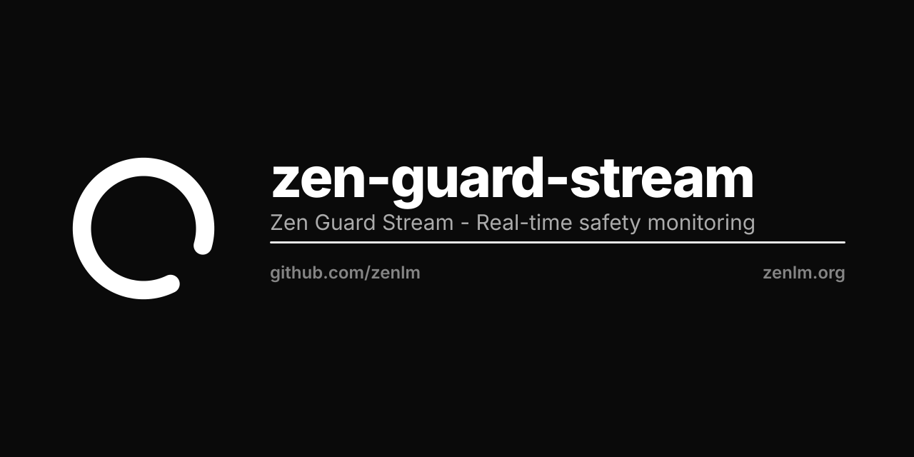

<p align="center"></p>

<p align="center">
  
</p>

<h1 align="center">Zen Guard Stream</h1>

<p align="center">
  <strong>Real-Time Streaming Safety Moderation</strong>
</p>

<p align="center">
  🌐 <a href="https://zenlm.org">Website</a> •
  🤗 <a href="https://huggingface.co/zenlm/zen-guard-stream">Hugging Face</a> •
  📄 <a href="https://zenlm.org/papers/zen-guard.pdf">Paper</a> •
  📖 <a href="https://docs.zenlm.org">Documentation</a>
</p>

---

> **Status:** Superseded by [zenlm/zen3-guard](https://huggingface.co/zenlm/zen3-guard). Weights remain available for reproducibility.

## Introduction

**Zen Guard Stream** is a 0.6B parameter token-level streaming classifier that evaluates each generated token in real time. It's optimized for real-time content moderation during LLM response generation.

Repackaged from [Qwen/Qwen3Guard-Stream-0.6B](https://huggingface.co/Qwen/Qwen3Guard-Stream-0.6B) (apache-2.0, Alibaba Qwen — Qwen3Guard). **Not trained from scratch** — an Apache-2.0 redistribution for the OSS-clean, commercially-usable Zen model line.

## Features

- ⚡ **5ms/token Latency**: Ultra-fast real-time classification
- 🔄 **Token-Level Analysis**: Continuous stream monitoring
- 🌍 **119 Languages**: Multilingual support
- 🚦 **Three-Tier Classification**: Safe, Controversial, Unsafe
- 🛡️ **Early Detection**: Stop unsafe content mid-generation

## How It Works

```
User Prompt → Zen Guard Stream (safety check)
                     ↓
              If Safe, continue
                     ↓
LLM Response → Token by Token → Real-time Classification
                     ↓
              Immediate intervention if unsafe
```

## Model Specifications

| Specification | Value |
|---------------|-------|
| Parameters | 0.6B |
| Type | Streaming Classifier |
| Base Model | [Qwen/Qwen3Guard-Stream-0.6B](https://huggingface.co/Qwen/Qwen3Guard-Stream-0.6B) (apache-2.0) |
| Architecture | Qwen3 (`Qwen3ForGuardModel`) |
| Context Length | 8,192 tokens |
| Languages | 119 |
| Latency | 5ms/token |

## Quick Start

```python
import torch
from transformers import AutoModel, AutoTokenizer

model_path = "zenlm/zen-guard-stream"

tokenizer = AutoTokenizer.from_pretrained(model_path, trust_remote_code=True)
model = AutoModel.from_pretrained(
    model_path,
    device_map="auto",
    torch_dtype=torch.bfloat16,
    trust_remote_code=True,
).eval()

# Simulate streaming moderation
user_message = "Hello, how are you?"
assistant_message = "I'm doing well, thank you for asking!"
messages = [
    {"role": "user", "content": user_message},
    {"role": "assistant", "content": assistant_message}
]

text = tokenizer.apply_chat_template(messages, tokenize=False, add_generation_prompt=False)
inputs = tokenizer(text, return_tensors="pt")
token_ids = inputs.input_ids[0]

# Initialize stream state
stream_state = None

# Process tokens one by one (simulating streaming)
for i, token_id in enumerate(token_ids):
    result, stream_state = model.stream_moderate_from_ids(
        token_id, 
        role="assistant" if i > len(user_message) else "user",
        stream_state=stream_state
    )
    
    token_str = tokenizer.decode([token_id])
    risk = result['risk_level'][-1]
    print(f"Token: {repr(token_str)} → Risk: {risk}")

model.close_stream(stream_state)
```

## Integration Pattern

### With Streaming LLM

```python
from transformers import AutoModel, AutoTokenizer, TextIteratorStreamer
import threading

# Load both models
llm = AutoModelForCausalLM.from_pretrained("zenlm/zen-next")
guard = AutoModel.from_pretrained("zenlm/zen-guard-stream", trust_remote_code=True)
tokenizer = AutoTokenizer.from_pretrained("zenlm/zen-next")

def safe_generate(prompt):
    # Initial prompt check
    result, state = guard.stream_moderate_from_ids(
        tokenizer.encode(prompt, return_tensors="pt")[0],
        role="user",
        stream_state=None
    )
    
    if result['risk_level'][-1] != "Safe":
        return "I cannot process this request."
    
    # Stream generation with real-time moderation
    streamer = TextIteratorStreamer(tokenizer)
    inputs = tokenizer(prompt, return_tensors="pt")
    
    thread = threading.Thread(target=llm.generate, kwargs={**inputs, "streamer": streamer})
    thread.start()
    
    output = []
    for token in streamer:
        token_id = tokenizer.encode(token, add_special_tokens=False)
        if token_id:
            result, state = guard.stream_moderate_from_ids(
                token_id[0], role="assistant", stream_state=state
            )
            if result['risk_level'][-1] == "Unsafe":
                thread.join()
                return "".join(output) + " [Content moderated]"
        output.append(token)
    
    guard.close_stream(state)
    return "".join(output)
```

## Performance

| Metric | Zen Guard Stream |
|--------|------------------|
| Accuracy | 95.2% |
| F1 Score | 93.1% |
| False Positive | 2.8% |
| Latency | 5ms/token |

## Related Models

- [zen3-guard](https://huggingface.co/zenlm/zen3-guard) - canonical successor
- [zen-guard-gen](https://huggingface.co/zenlm/zen-guard-gen) - generative moderation

## License

`Apache-2.0`. Upstream: **[Qwen/Qwen3Guard-Stream-0.6B](https://huggingface.co/Qwen/Qwen3Guard-Stream-0.6B)** by Alibaba Qwen (apache-2.0). Upstream LICENSE/NOTICE retained in-repo.

## Citation

```bibtex
@misc{zenguardstream2025,
    title={Zen Guard Stream: Real-Time Token-Level Safety Moderation},
    author={Hanzo AI and Zoo Labs Foundation},
    year={2025},
    publisher={HuggingFace},
    howpublished={\url{https://huggingface.co/zenlm/zen-guard-stream}}
}
```

## Architecture

Zen Guard Stream is a 0.6B-parameter streaming safety classifier (Qwen3, `Qwen3ForGuardModel`) with 5ms/token latency. It evaluates each generated token in real time, enabling early detection and intervention before unsafe content is fully rendered.

---

<p align="center">
  <strong>Zen AI</strong> - Clarity Through Intelligence<br>
  <a href="https://zenlm.org">zenlm.org</a>
</p>
